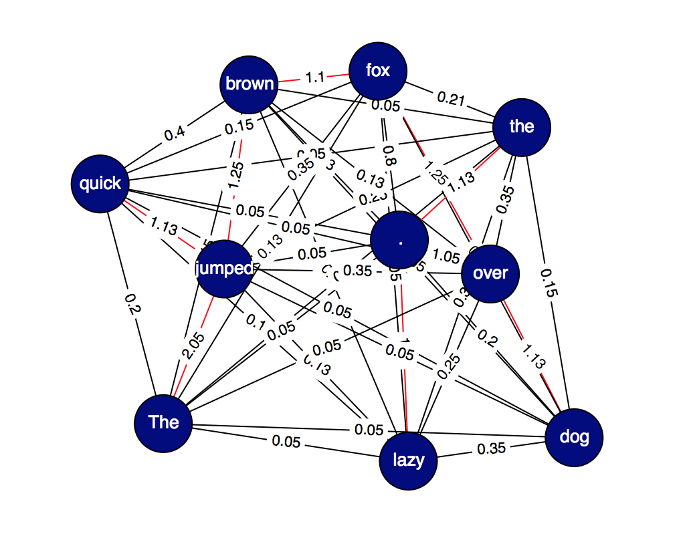

# Ada

Goal of this app is to extract information and output a summarized version of a given piece of text, image, or video. By doing so, the algorithm should produce a knowledge graph in which the user can ask more questions about the text.

Knowledge graphs should be shared between users into (multiple or single) graphs. The algorithm can then draw on more information to provide the user additional informations.

## vision
With the ability to convert data into a knowledge graph, the summarization tool is only a start. The larger goal is to convert the algorithm into a AI/ML based frontend for the web. Instead of googling things, you just ask questions and receive answers (more "ergonomic") approach.

**Step 1 :** a chrome extension that you can query.

**Step 2 :** a browser that isn't really a browser. It's just a AI that you can chat with to surf the semantic web.

**Step 3:** an operating system basically like the one from the movie "Her".

## technical pieces
- Text analysis
	- Tokenizer (Learn keywords)
	- Learn the high dimensional space that text lies in
	- Convert the features into a knowledge graph (unsupervised clustering possibly)
	- Summarization
- App
	- Chrome Extension
	- Server to store the knowledge graph (try neo4j)

## natural language processing: AdaNLP
A lot of Ada is using deep learning to extract semantic meaning from text data. Like CoreNLP, AdaNLP pulls information like part-of-speech, name-entity, and dependencies. These are stored in a JSON and are useful for processing later in the pipeline like creating a `SemanticGraph`.

```
{
	'num_sentences': 0,
	'sentence-0': {
		'tokens': ['i', 'like', 'dogs'],
		'lemmas': ['i', 'like', 'dog'],
		'pos_tags': ['LS', 'IN', 'NNS'],
		'ner_tags': ['O', 'O', 'O'],
		'dep_tags': ...
	}
}
```

## semantic graph: AdaGraph
The semantic graph is a list of `GraphNodes` with a dictionary of edges. The edges are stored in a `defaultdict` of `defaultdict` where the inner dictionary stores edge type. For example, an edge type can be `adjacency`, indicating neighbor ondes or `coref` which connect corefering nodes.

```
defaultdict(<function graph.<lambda>>,
            {'e_0_1': defaultdict(<function graph.<lambda>>,
                         {'adjacency-1': 0.15, 'sentence-0': 0.05}),
             'e_0_2': defaultdict(<function graph.<lambda>>,
                         {'adjacency-2': 0.1, 'sentence-0': 0.05}),
             'e_0_3': defaultdict(<function graph.<lambda>>,
                         {'adjacency-3': 0.08, 'sentence-0': 0.05}),
             'e_0_4': defaultdict(<function graph.<lambda>>,
                         {'dependency-det': 1.0,
                          'dependency-root': 1.0,
                          'sentence-0': 0.05}),
       	    }
)
```

#### AdaGraph Example
The semantic graph for the semantice: The quick brown fox jumped over the lazy dog.


